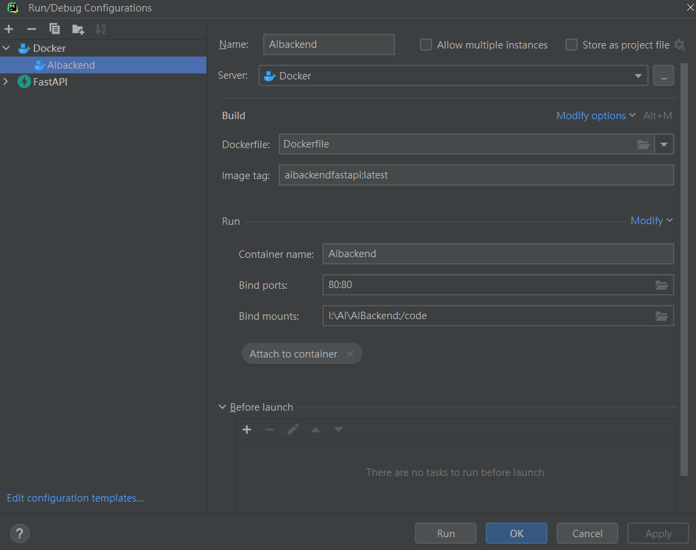

# AI Backend FastApi

### how to set docker in pycharm
1. set Docker server for all project
2. setup run/debug configuration , you can choose `Dockerfile` or `Docker compose`
3. set interrupter 

## set Run configuration for dockerfile 
1. click `Run/Debug configration` and `+`
2. choose `Docker`
3. choose your Dockerfile in `Dockerfile` and image name
4. set `bind port` for visit in local browser
5. set `bind mounts` for watching changes

